# Optimization of GC-MS/SPME Experimental Conditions

This repository contains the complete analysis of a Central Composite Design (CCD) experiment aimed at optimizing the extraction conditions for solid-phase microextraction (SPME) coupled to gas chromatography-mass spectrometry (GC-MS) for fecal metabolomics. The primary objective was to identify the combination of extraction, desorption, and incubation times that maximizes the detection and intensity of clinically relevant metabolites, with particular focus on compounds associated with the gut-brain axis.

**Data do not correspond to patients or controls; they are proprietary.**

---

## Context and motivation

Metabolomic analysis of fecal samples by GC-MS requires an extraction step that is highly sensitive to operating conditions. Small variations in fiber incubation time, desorption temperature, or headspace exposure time can translate into substantial differences in chromatographic profile coverage and intensity.

Rather than optimizing conditions empirically, a structured experiment was designed following response surface methodology (RSM), complemented by supervised machine learning models. The rationale was twofold: to extract the maximum information with the minimum number of experiments, and to assess whether ML models can identify trends that classical RSM does not capture with N=17.

---

**Table 1. Notebook architecture and purpose of each block**

| Block | Question it answers | Role in the workflow |
|-------|--------------------|--------------------|
| 1. Preliminary validation | Are the input data consistent? | Ensures that the design, area matrix, and sample homogeneity allow meaningful modeling. |
| 2. DOE coding | How are the factors brought to a common scale? | Converts extraction, desorption, and incubation to comparable coded coordinates. |
| 3. Responses and D_global | What does it mean for a run to be globally good? | Defines quantitative performance metrics and a global desirability function. |
| 4. D_biomarkers | Which conditions specifically favor priority biomarkers? | Introduces an objective function directed at indoles, p-cresol, methional, and carboxylic acids. |
| 5. DOE exploration | What basic trends appear before formal modeling? | Distributions, simple relationships, reproducibility, and interactions. |
| 6. RSM | Can a quadratic model describe the response surface? | Fits classical DOE models and proposes theoretical optima. |
| 7. Machine Learning | Which model predicts best with N=17? | Compares PLS, RandomForest, XGBoost, GaussianProcess, and RSM. |
| 8. Interpretability | Which factor dominates system behavior? | Uses SHAP, permutation importance, and PDP to rank effects. |
| 9. Final optimization | How are optima translated into actual minutes? | Converts from coded space to operating conditions for the protocol. |

---

## Experimental design

A Central Composite Design (CCD) with three factors and 17 experiments in total was used: 8 factorial points (Experiments 1–8), 6 axial points (Experiments 9, 10, 11, 12, 13, and 17), and 3 central points (Experiments 14, 15, and 16).

**Table 2. Preliminary validation of the experimental design**

| Element | Result | What it checks |
|---------|--------|----------------|
| Experimental design | 17 experiments × 7 columns | Structural basis of the CCD |
| Area matrix | 17 experiments × 140 metabolites | Quantitative matrix on which responses are built |
| Metabolites of interest | 123 in list; 26 detected and usable | Initial target panel for directed analysis |
| Sample weight | 32.9 ± 0.6 mg; CV = 1.86% | High homogeneity; weight does not introduce relevant variability |
| Point types | 8 factorial, 6 axial, 3 central | Balanced coverage of the experimental space |

The matching between the 123 target metabolites and the actual area matrix yields only 26 usable compounds. This is methodologically important: the optimization does not seek to maximize any signal, but a specific and clinically meaningful fraction of the metabolomic profile.

**Table 3. Coding parameters for the experimental factors**

| Coded variable | Experimental factor | Real min (min) | Real max (min) | Range |
|----------------|--------------------|--------------:|--------------:|------:|
| $x_1$ | Headspace extraction time (SPME fiber) | 0.6 | 120.0 | 119.4 |
| $x_2$ | Thermal desorption time in the injector | 0.3 | 3.7 | 3.4 |
| $x_3$ | Prior sample incubation time | 1.7 | 19.2 | 17.5 |

Throughout the analysis, $x_1$, $x_2$, and $x_3$ are used systematically to refer to these factors in coded scale $[-1, +1]$. The forward transformation and its inverse are:

$$x_\text{cod} = \frac{2\,(x_\text{real} - x_\text{min})}{x_\text{max} - x_\text{min}} - 1$$

$$x_\text{real} = x_\text{min} + \frac{x_\text{cod} + 1}{2}\,(x_\text{max} - x_\text{min})$$

**Figure 1 — Preliminary validation**

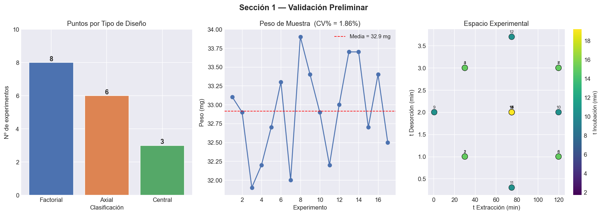

Three panels showing the distribution of point types in the CCD, the evolution of sample weight across runs, and the spatial coverage of the design. The weight panel confirms excellent homogeneity (CV = 1.86%); the spatial scatter shows that the domain has been explored without visible bias.

**Figure 2 — Coded CCD design**

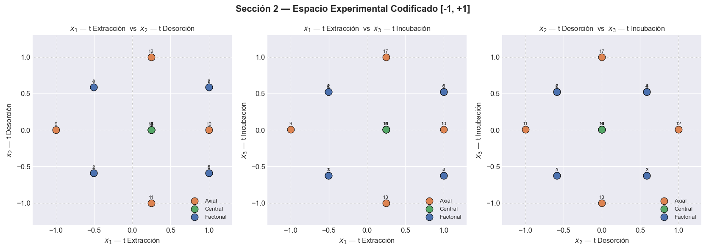

Representation of the CCD in coded space for the three factor pairs ($x_1$-$x_2$, $x_1$-$x_3$, $x_2$-$x_3$). Confirms that the factorial corners, axial extremes, and central replicates are positioned in the expected central composite geometry.

---

## Response variables and D_global function

From the 140 metabolites quantified by normalized area, four complementary responses were constructed covering different dimensions of analytical performance.

**Table 4. Descriptive statistics of the constructed responses**

| Response | Minimum | Maximum | Mean | SD |
|----------|---------|---------|------|-----|
| Y_detected_count (total peaks) | 78 | 140 | 132.82 | 14.63 |
| Y_interest_intensity (sum of target areas) | 2.35 × 10⁷ | 1.77 × 10⁹ | 1.21 × 10⁹ | 4.80 × 10⁸ |
| Y_precision_score | 0.00236 | 0.00391 | 0.00252 | 0.00037 |
| Y_interest_detected (target peaks) | 21 | 37 | 34.76 | 3.72 |

From these four components, D_global is built (composite desirability with scenario-weighted values). In the base scenario, D_global reaches a mean of 0.311 and a maximum of 0.449.

**Table 5. Five best runs by D_global (base scenario)**

| Experiment | Type | D_global | Y_detected | Y_interest_detected |
|------------|------|----------|-----------|---------------------|
| Exp. 10 | Axial | 0.4490 | 135 | 35 |
| Exp. 8 | Factorial | 0.4421 | 136 | 35 |
| Exp. 11 | Axial | 0.4298 | 135 | 36 |
| Exp. 4 | Factorial | 0.4031 | 129 | 33 |
| Exp. 2 | Factorial | 0.3900 | 129 | 34 |

**Figure 3 — D_global by weighting scenario**

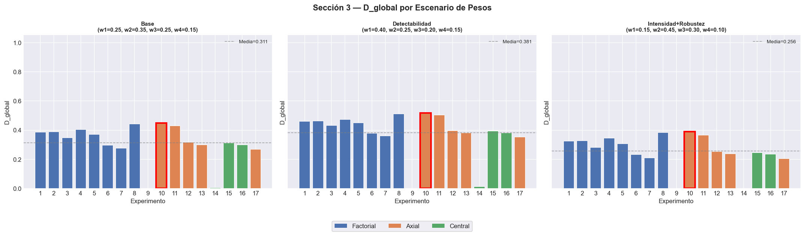

The three scenarios produce different means but maintain the same top ranking (experiments 10, 8, 11). Experiment 9 consistently appears as the worst across all scenarios. The stability of the ranking validates that the index is not an artifact of a particular choice of weights.

---

## D_biomarkers: objective function for priority families

In parallel with D_global, a second objective function was constructed focused exclusively on four biomarker families with clinical relevance for the microbiota-gut-brain axis.

**Table 6. Metabolite families integrated in D_biomarkers**

| Family | Aggregated compounds | Relevance |
|--------|---------------------|-----------|
| Indoles | 4 | Biomarkers of microbiota tryptophan metabolism; relevant to the gut-brain axis |
| p-Cresol | 2 | Indicator of bacterial protein metabolism activity |
| Methional | 2 | Volatile sulfur compound; most heterogeneous and penalizing family in the index |
| Carboxylic acids | 6 | Short- and branched-chain fatty acids; signal of colonic fermentative metabolism |

Each family is normalized to $[0, 1]$ following the formalism of Derringer and Suich (1980). For "higher is better" responses, the individual desirability $d_i$ is defined as:

$$d_i = \begin{cases} 0 & \text{if } y_i \leq L \\ \left(\dfrac{y_i - L}{U - L}\right)^s & \text{if } L < y_i < U \\ 1 & \text{if } y_i \geq U \end{cases}$$

where $L$ is the lower acceptable limit, $U$ is the target value, and $s$ is a shape parameter ($s = 1$ is equivalent to linear interpolation). In the adopted implementation, following the adaptation of Jové et al. (2021), $L = 0$, $U = \max(y_i)$, and $s = 1$ were used, so that $d_i = y_i / \max(y_i)$.

The composite desirability is calculated as the geometric mean of the four components:

$$D_{\text{biomarkers}} = \left(d_{\text{Indoles}} \cdot d_{\text{p-Cresol}} \cdot d_{\text{Methional}} \cdot d_{\text{Acids}}\right)^{1/4}$$

The key property of the geometric mean is that if any $d_i = 0$, the composite index collapses to zero, ensuring that the optimal solution does not sacrifice any biomarker family.

**Table 7. Quantitative summary of the D_biomarkers index**

| Indicator | Result |
|-----------|--------|
| D_biomarkers range | 0.000 – 0.839 |
| Mean ± SD | 0.493 ± 0.284 |
| CV% | 57.7% |
| Top 1: Exp. 5 (Factorial) | D = 0.839 — best observed globally |
| Top 2: Exp. 12 (Axial) | D = 0.775 |
| Top 3: Exp. 16 (Central) | D = 0.762 — best central point |
| Bottom 1: Exp. 9 (Axial) | D = 0.000 — total failure in all families |
| Bottom 2: Exp. 2 (Factorial) | D = 0.136 |
| Bottom 3: Exp. 3 (Factorial) | D = 0.148 |
| Mean Central points (n=3) | 0.741 ± 0.021 |
| Mean Axial points (n=6) | 0.540 ± 0.304 |
| Mean Factorial points (n=8) | 0.364 ± 0.268 |

The central-factorial difference ($\Delta = 0.377$) is statistically relevant given the index range. The central points are the most favorable and most repeatable region of the design for joint biomarker extraction.

**Figure 4 — Distributions of individual desirability by family**

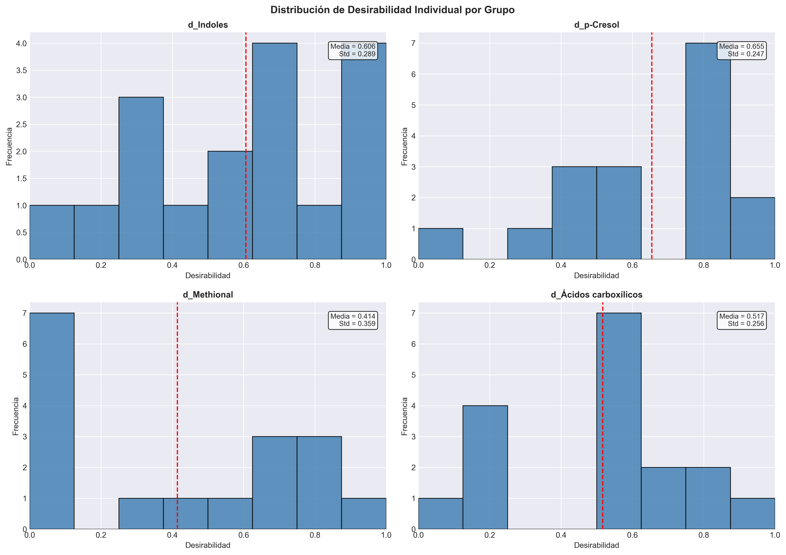

Histograms of $d_\text{indoles}$, $d_\text{p-cresol}$, $d_\text{methional}$, and $d_\text{carbox}$. p-Cresol and indoles show relatively high means (>0.6) and more symmetric distributions. Methional shows the greatest asymmetry and the highest number of experiments in the low zone ($d < 0.3$ in experiments 1, 2, 3, 4, 6, 7, 9, and 17), being the family that most penalizes the geometric mean.

**Figure 5 — D_biomarkers distribution**

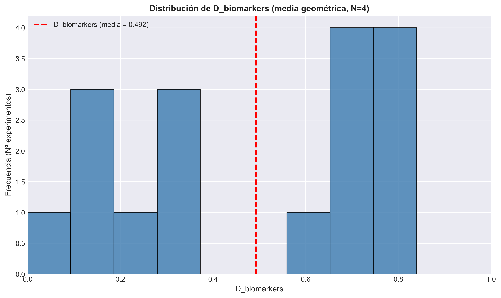

The histogram covers practically the entire range [0, 0.84] with mean ≈ 0.49 and wide dispersion. The absence of collapse into a narrow band indicates that the index discriminates well between experimental conditions, a necessary condition for subsequent modeling to have a learnable signal.

**Figure 6 — D_biomarkers by design type**

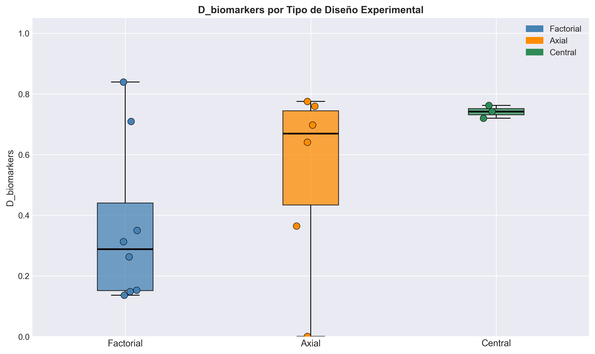

The three design types show clearly distinct behaviors. Central points are in the high zone (mean 0.74) with minimal dispersion (std = 0.021). Axial points are the most variable and include the worst case (exp. 9, D = 0). Factorial points have the lowest mean and high dispersion, consistent with exploration of domain corners.

**Figure 7 — D_biomarkers by experiment**

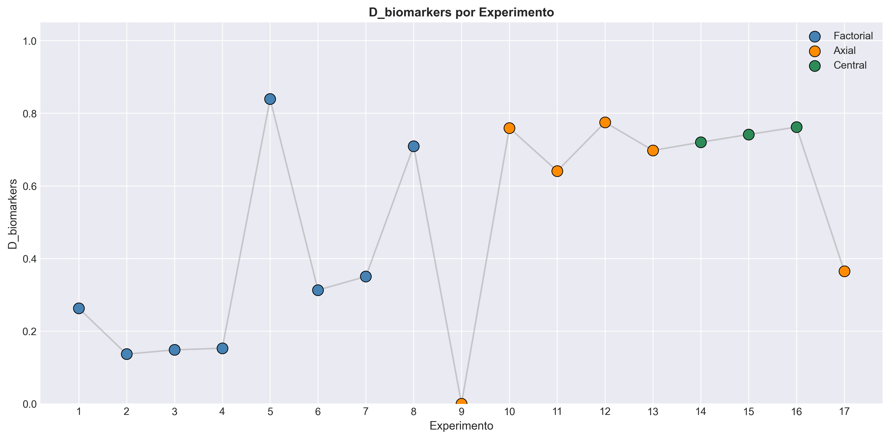

Experiment-by-experiment profile. Exp. 5 as the absolute maximum and exp. 9 as the minimum. There is no monotonic trend by experiment number, confirming that biomarker performance depends on the specific combination of ($x_1$, $x_2$, $x_3$) and not on run-order factors.

**Figure 8 — Correlation matrix among desirabilities**

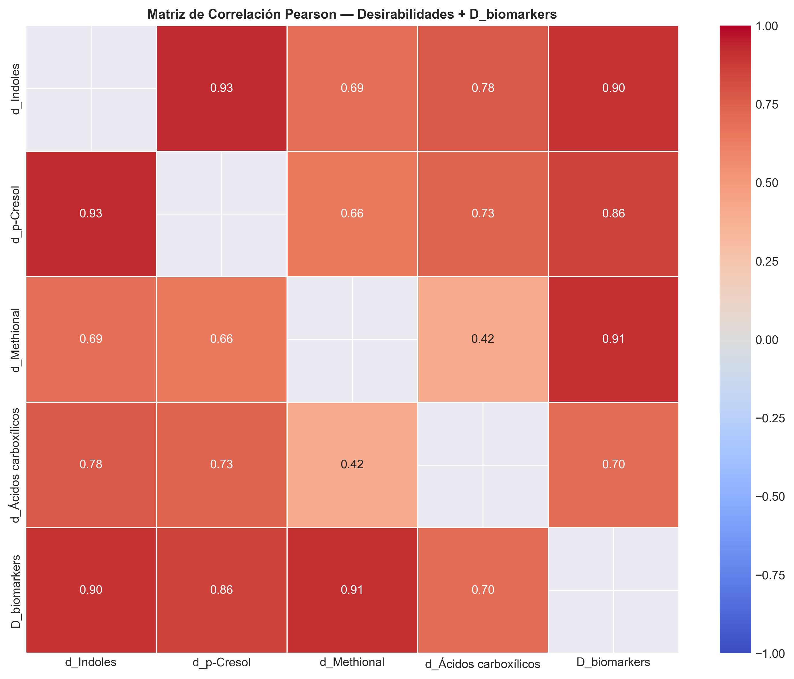

Correlations with D_biomarkers are: Methional $r = 0.910$, Indoles $r = 0.902$, p-Cresol $r = 0.858$, Carboxylic acids $r = 0.700$. The fact that improving any family tends to pull the others in the same direction justifies the geometric mean as a joint index: there is genuine synergy among families.

---

## DOE exploration and factorial analysis

**Table 8. Repeatability at the three central points (Exp. 14, 15, 16)**

| Response | Exp. 14 | Exp. 15 | Exp. 16 | Mean | CV% | Assessment |
|----------|---------|---------|---------|------|-----|-----------|
| Y_detected_count | 140 | 139 | 139 | 139.33 | 0.4% | Excellent |
| Y_interest_detected | 37 | 37 | 36 | 36.67 | 1.6% | Excellent |
| Y_interest_intensity | 1.229×10⁹ | 1.617×10⁹ | 1.471×10⁹ | 1.439×10⁹ | 13.6% | Acceptable |
| Y_precision_score | 0.0024 | 0.0024 | 0.0024 | 0.0024 | 0.0% | Excellent |
| D_global | 0.005 | 0.312 | 0.299 | 0.205 | 84.6% | High variability |

Several responses show excellent repeatability at central points, but D_global shows high variability (CV = 84.6%). This warns that the combined function is very sensitive to small differences between partial responses, particularly from the precision component.

Additional results from the exploratory analysis:

- Pearson correlation between $x_1$ and Y_interest_intensity: **r = 0.825** (the highest in the dataset).
- Strongest main effect: $x_1$ on Y_interest_detected, with a clear positive jump between low (−1) and high (+1) level.
- Most relevant interaction: $x_2 \times x_3$ (desorption × incubation) on Y_interest_detected.
- The effect of $x_3$ (incubation) is slightly negative when moving from −1 to +1, suggesting that very long incubation times may favor thermal degradation processes or competition for the SPME fiber.

**Figure 9 — Response distributions**

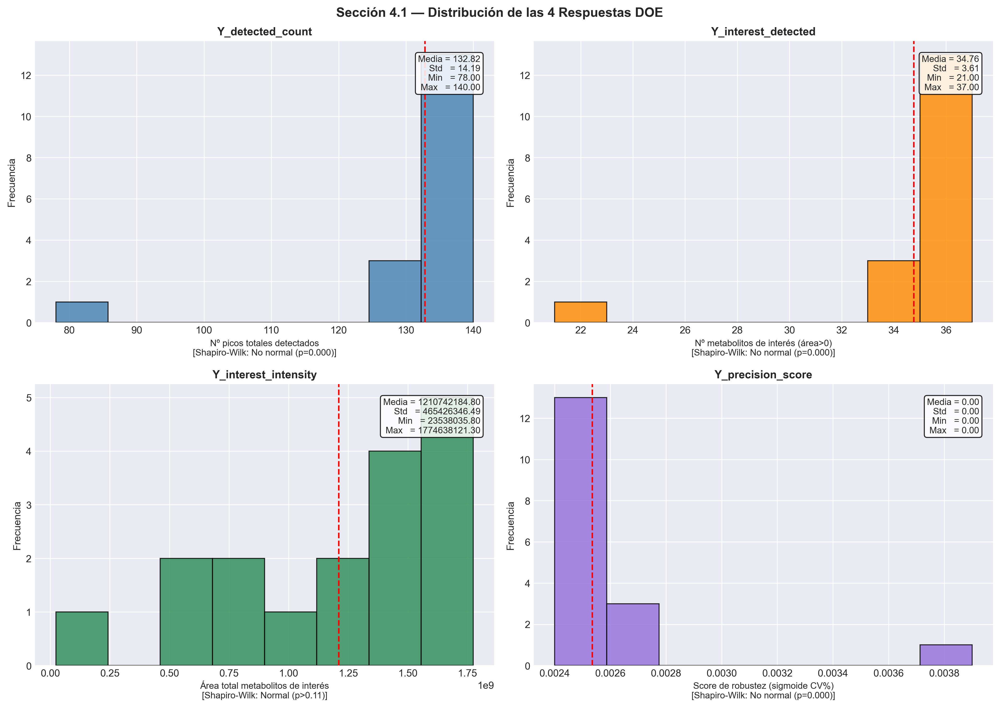

Histograms of the four responses. Count responses show skew toward high values; intensity is the most dispersed; the precision score occupies a narrow low band across all experiments.

**Figure 10 — Factors vs Y_interest_detected**

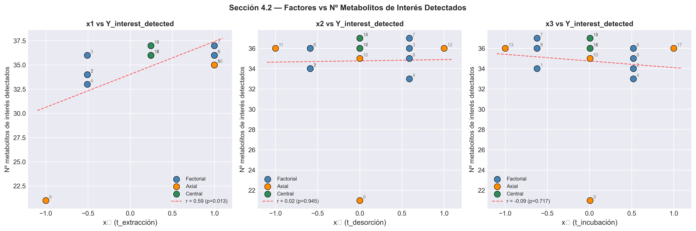

The $x_1$ panel shows a scatter with a visible positive slope. The $x_2$ and $x_3$ panels show no clear trends, confirming that the simple linear effect of desorption and incubation on detectability is small compared to that of extraction.

**Figure 11 — 3D experimental space**

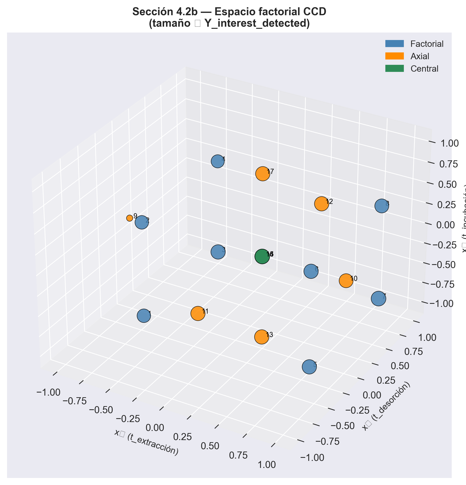

3D visualization of the 17 experiments in the ($x_1$, $x_2$, $x_3$) domain, colored by point type and scaled in size by response. Allows verification that there is no excessive accumulation in any region.

**Figure 12 — Factor-response correlation heatmap**

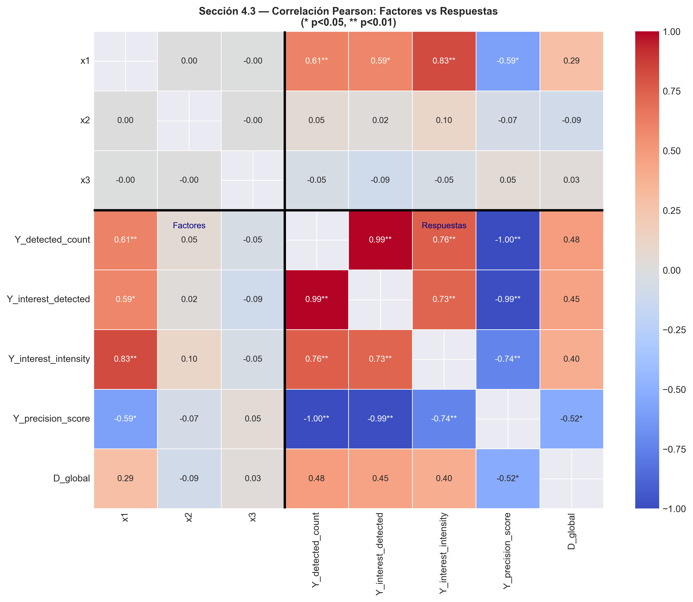

$x_1$ correlates positively and significantly with Y_detected, Y_intensity, and D_biomarkers. It shows a negative correlation with the precision score, explaining why D_global does not grow proportionally to Y_intensity when $x_1$ increases.

**Figure 13 — Boxplots by DOE classification**

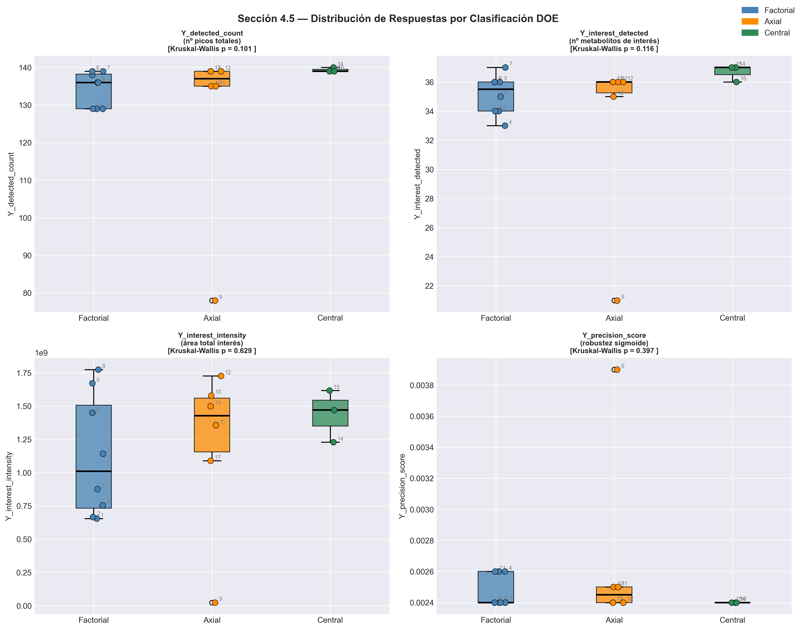

Central points show the lowest dispersion across all responses. Axial points concentrate the extreme cases. Factorial points show wide dispersion, especially in intensity.

**Figure 14 — Main effects**

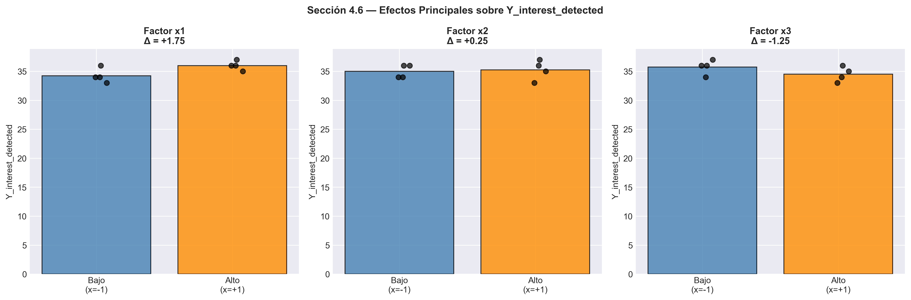

The jump in $x_1$ from low to high level is clearly the largest. $x_2$ shows minimal change. $x_3$ shows a moderate negative effect when moving from −1 to +1.

**Figure 15 — Interaction plots**

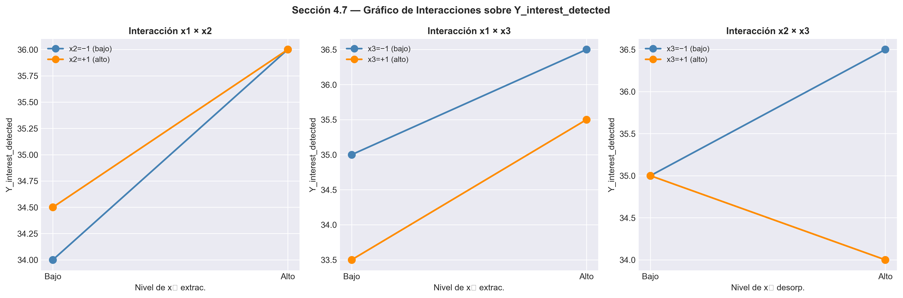

The $x_1 \times x_2$ and $x_1 \times x_3$ interaction lines are approximately parallel, indicating that the effect of $x_1$ does not strongly depend on the level of $x_2$ or $x_3$. The $x_2 \times x_3$ interaction does show diverging lines, justifying inclusion of the $x_2 \cdot x_3$ interaction term in the RSM model.

---

## RSM Modeling (Response Surface Methodology)

Three second-order quadratic models were fitted, one per target. The general model form is:

$$\hat{y} = \beta_0 + \beta_1 x_1 + \beta_2 x_2 + \beta_3 x_3 + \beta_{11} x_1^2 + \beta_{22} x_2^2 + \beta_{33} x_3^2 + \beta_{12} x_1 x_2 + \beta_{13} x_1 x_3 + \beta_{23} x_2 x_3$$

Validation was carried out exclusively with LOOCV given that N = 17.

**Table 9. Fitting and cross-validation metrics for RSM models**

| Model | Target | R²_train | R²_LOOCV | RMSE_train | RMSE_LOOCV | Diagnosis |
|-------|--------|----------|----------|-----------|-----------|----------|
| RSM_1 | Y_interest_detected | 0.813 | −0.613 | 1.56 | 4.58 | High overfitting |
| RSM_2 | Y_interest_intensity | 0.919 | +0.330 | 1.33×10⁸ | 3.81×10⁸ | Moderate |
| RSM_3 | D_biomarkers | 0.891 | −0.083 | 0.091 | 0.287 | High overfitting |

All three models fit well in training ($R^2$ between 0.81 and 0.92), but only RSM_2 generalizes with moderate capability. RSM_1 and RSM_3 have negative $R^2_\text{LOOCV}$: they predict worse than simply using the mean. The diagnosis is structural: a full second-order model with 10 terms applied to 17 points leaves very few degrees of freedom for cross-validation.

In all three models, $x_1$ and $x_1^2$ are the most important terms (measured as $|\beta| \times -\log_{10}(p)$). For RSM_1: importance of $x_1 = 13.908$, $p = 0.0019$ (***). For D_biomarkers, $x_2 \cdot x_3$ and $x_3^2$ also stand out, consistent with the interaction detected in the factorial analysis.

**Table 10. Theoretical optima predicted by RSM in real units**

| Model | Target | $x_1$ | $x_2$ | $x_3$ | t_ext (min) | t_des (min) | t_inc (min) | Predicted Y* |
|-------|--------|--------|--------|--------|------------|------------|------------|-------------|
| RSM_1 | Y_detected | +0.532 | −0.590 | −1.000 | 92.1 | 1.00 | 1.7 | 39.04 metabolites |
| RSM_2 | Y_intensity | +1.000 | +0.084 | +1.000 | 120.0 | 2.14 | 19.2 | 1.887 × 10⁹ |
| RSM_3 | D_biomarkers | +1.000 | −1.000 | +1.000 | 120.0 | 0.30 | 19.2 | 1.36 (*) |

(*) $D_\text{biomarkers} > 1$ indicates extrapolation outside the data space; the actual value is bounded to $[0, 1]$. This result is an additional sign of overfitting.

**Figure 16 — RSM parity plots**

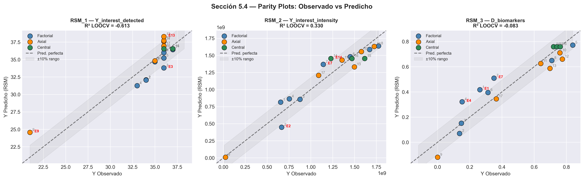

RSM_2 follows the diagonal reasonably well, consistent with its better $R^2_\text{LOOCV}$. RSM_1 shows points that systematically deviate at the extremes. RSM_3 presents the most erratic pattern, explainable by the nature of D_biomarkers as a geometric mean.

**Figure 17 — RSM response surfaces**

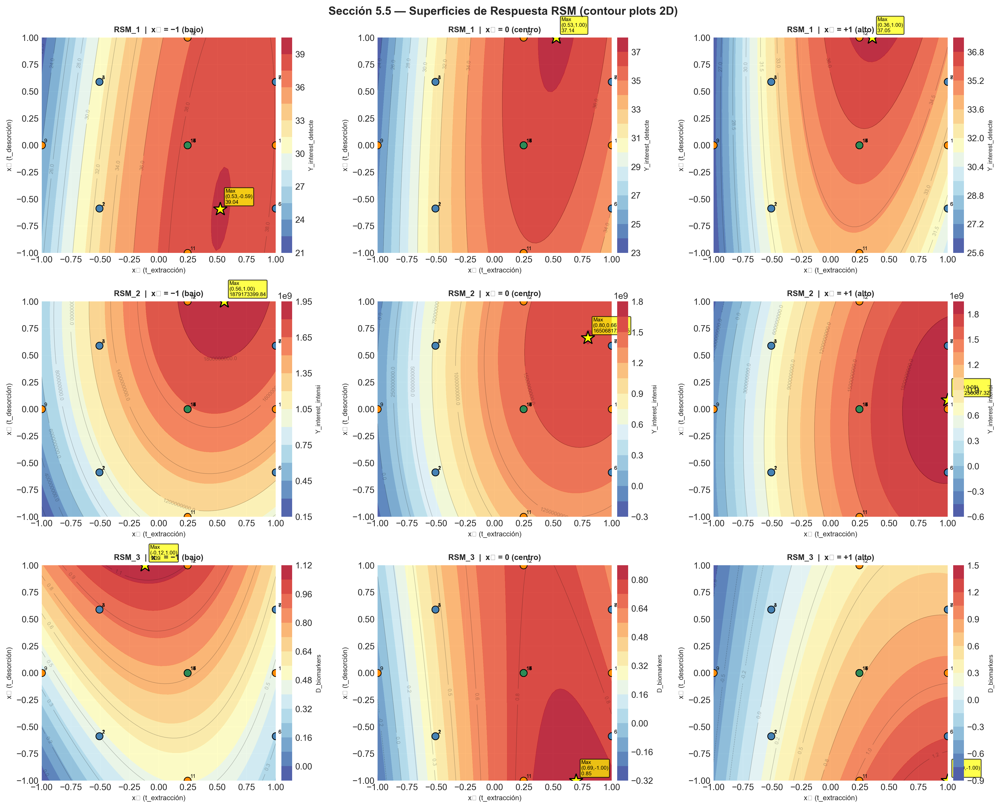

The surfaces confirm that the highest-response zones tend to concentrate in the high-$x_1$ region. The curvature is non-negligible, justifying $x_1^2$ in the model. For D_biomarkers, the surfaces show a peak outside the $[-1, 1]$ range, generating the extrapolation problem mentioned above.

**Figure 18 — RSM term ranking**

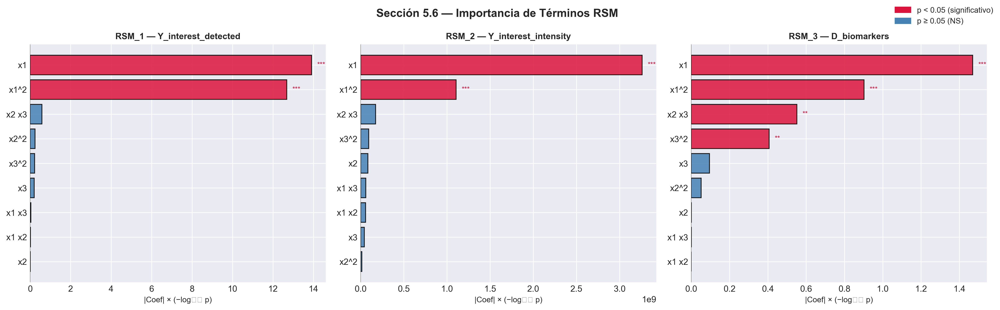

Bar chart placing $x_1$ and $x_1^2$ well above the rest in RSM_1 and RSM_2. In RSM_3, $x_2 \cdot x_3$ and $x_3^2$ also appear with comparable importances. Red bars ($p < 0.05$) distinguish statistically significant terms.

**Figure 19 — RSM residual diagnostics**

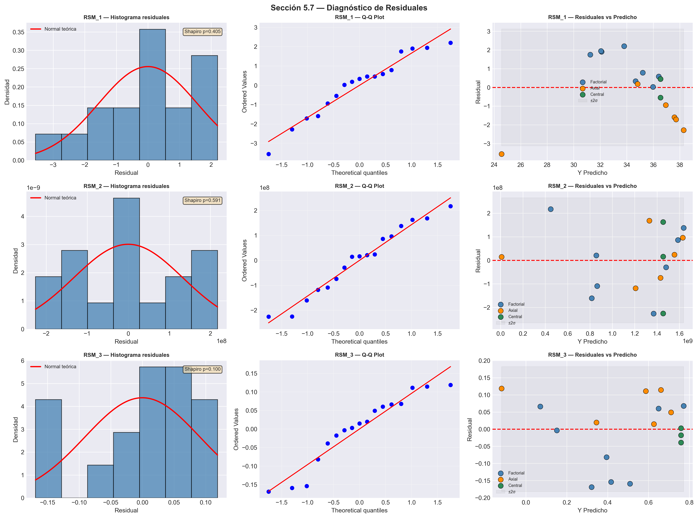

RSM_2 residuals pass the Shapiro-Wilk test ($p > 0.05$). RSM_1 and RSM_3 show more marked deviations. The primary problem with RSM is not the residual distribution but the data-to-parameter ratio (17 observations for a 10-term model).

---

## Supervised ML: model comparison

Four ML algorithms were compared against RSM using LOOCV as the validation protocol. All models use the three coded variables ($x_1$, $x_2$, $x_3$) as their only inputs.

- **PLS** (Partial Least Squares, n_components=2)
- **RandomForest** (n_estimators=50, max_depth=4, min_samples_leaf=2)
- **XGBoost** (n_estimators=50, max_depth=3, learning_rate=0.1)
- **GaussianProcess** (default kernel)

**Table 11. Global generalization ranking (mean $R^2_\text{CV}$ across three targets)**

| Model | Y_detected | Y_intensity | D_biomarkers | Mean $R^2_\text{CV}$ | Ranking |
|-------|-----------|------------|-------------|---------------------|---------|
| RandomForest | −0.127 | +0.557 | +0.487 | **0.306** | 1st |
| XGBoost | +0.136 | +0.468 | +0.213 | **0.272** | 2nd |
| PLS | −0.197 | +0.448 | +0.081 | **0.111** | 3rd |
| RSM | −0.613 | +0.330 | −0.083 | **−0.122** | 4th |
| GaussianProcess | −5.127 | +0.701 | +0.205 | **−1.407** | 5th |

RandomForest is the most balanced model across targets. XGBoost is the only one achieving positive $R^2_\text{CV}$ for Y_detected (0.136). GaussianProcess is the best individual model for Y_intensity ($R^2_\text{CV} = 0.70$), but the worst in overall generalization due to its collapse on Y_detected.

The composite ranking integrates four weighted criteria: Performance 40% ($R^2_\text{CV}$), Interpretability 30%, Robustness 20%, and Complexity 10%. Final scores: RandomForest = 36.0, PLS = 35.1, RSM = 34.2, XGBoost = 31.1, GaussianProcess = 8.8.

**Table 12. Convergence across interpretability methods (dominant factor)**

| Target | Factor #1 by SHAP | Factor #1 by permutation | Agreement |
|--------|------------------|-------------------------|-----------|
| Y_detected | $x_1$ (extraction) | $x_1$ (extraction) | Full |
| Y_intensity | $x_1$ (extraction) | $x_1$ (extraction) | Full |
| D_biomarkers | $x_1$ (extraction) | $x_1$ (extraction) | Full |

All three methods converge without exception: $x_1$ is the dominant factor for all targets. RandomForest and XGBoost assign approximately **70% of total importance to $x_1$**, ~20% to $x_3$, and the remaining ~10% to $x_2$.

**Figure 20 — ML parity plots**

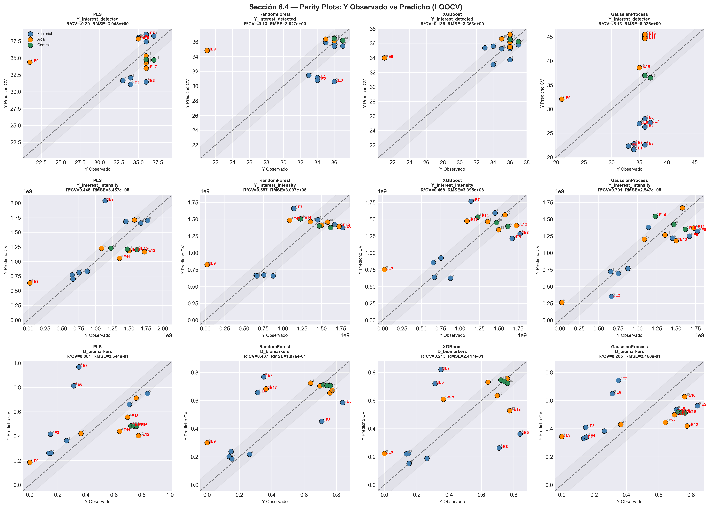

Y_intensity shows the most ordered parity plots around the diagonal across all models. Y_detected shows the greatest dispersion. For D_biomarkers, RandomForest best follows the diagonal. GaussianProcess stands out visually for Y_intensity, consistent with its $R^2_\text{CV} = 0.70$.

**Figure 21 — Feature importance RF and XGBoost**

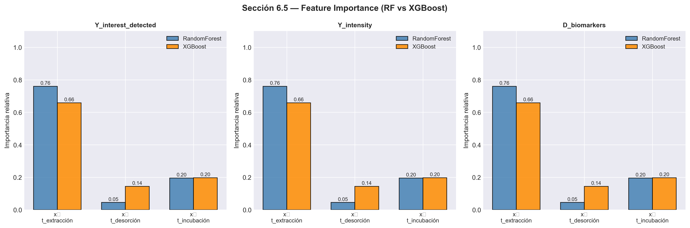

Both models assign ~70% of importance to $x_1$. This hierarchy is fully consistent with the main effects from the DOE and the RSM coefficients.

**Figure 22 — Learning curves**

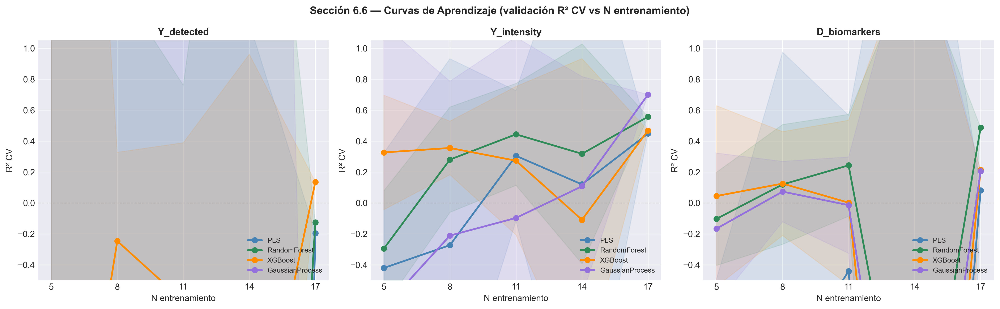

The gap between training and validation performance is notable for N = 17. Models have not reached their maximum generalization capacity. Expanding the DOE with more experimental points would improve prediction more than any additional hyperparameter tuning.

**Figure 23 — Prediction correlation**

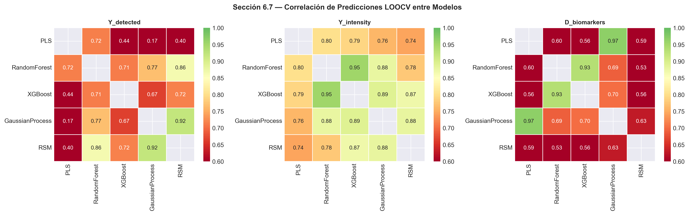

For Y_intensity, inter-model correlations are high ($r > 0.85$), indicating that all algorithms are learning the same real signal. For D_biomarkers, consensus is lower, consistent with the greater variability of that target.

---

## Cross-validation: residual analysis

**Table 13. LOOCV residual normality — Shapiro-Wilk test**

| Target | PLS | RandomForest | XGBoost |
|--------|-----|-------------|---------|
| Y_detected | $p = 0.001$ — not normal | $p = 0.000$ — not normal | $p = 0.000$ — not normal |
| Y_intensity | $p = 0.218$ — normal | $p = 0.129$ — normal | $p = 0.840$ — normal |
| D_biomarkers | $p = 0.401$ — normal | $p = 0.231$ — normal | $p = 0.368$ — normal |

Y_detected is the problematic target: LOOCV residuals reject normality in all three models. Y_intensity and D_biomarkers show residuals compatible with normality, making their fit metrics more interpretable.

**Figure 24 — Residuals vs predicted (LOOCV)**

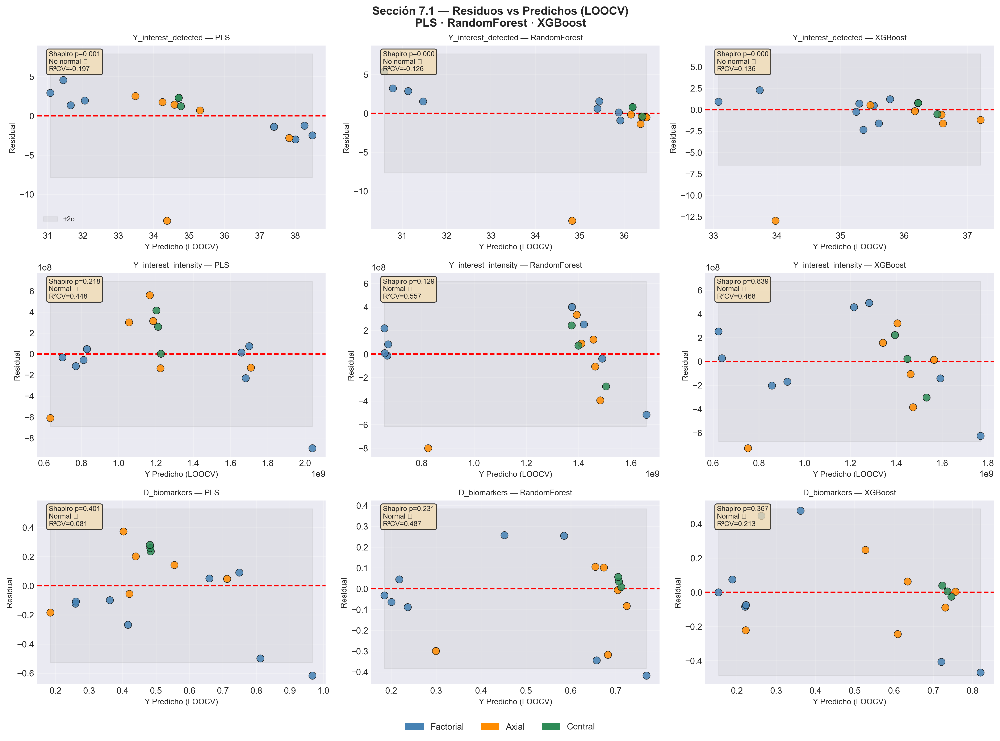

Y_detected shows clear residual structure — errors are not random with respect to the prediction level. Y_intensity and D_biomarkers show residuals more homogeneously dispersed around zero.

**Figure 25 — Residual Q-Q plots**

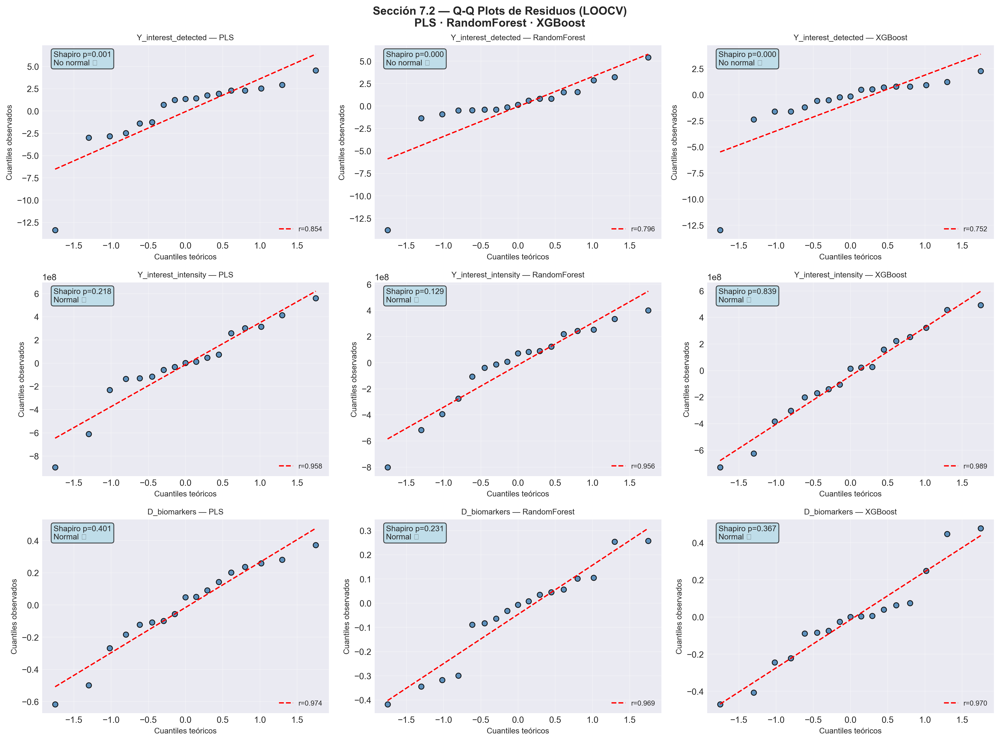

Y_detected shows deviations in both tails, especially the right tail (large positive errors). Y_intensity and D_biomarkers conform reasonably well to the diagonal.

---

## Interpretability: SHAP, permutation importance, and PDP

**Figure 26 — SHAP summary**

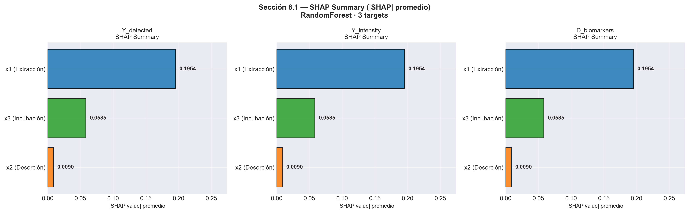

Bar charts with mean $|\text{SHAP}|$ per factor and per target. $x_1$ clearly exceeds $x_2$ and $x_3$ in impact magnitude for all three targets. The hierarchy $x_1 \gg x_3 > x_2$ remains constant.

**Figure 27 — Permutation importance**

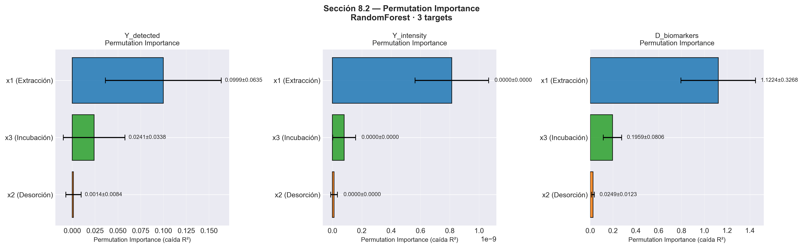

The same hierarchy $x_1 > x_3 > x_2$ is reproduced with a different method ($R^2$ loss when permuting each variable, n_repeats=10). Agreement with SHAP validates that the interpretability conclusions are not method-dependent.

**Figure 28 — Partial Dependence Plots (PDP)**

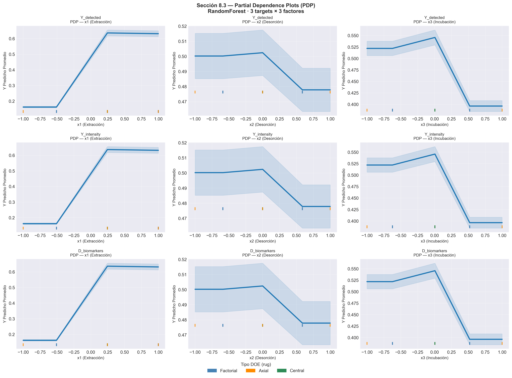

$x_1$ shows a clearly increasing and pronounced curve: extending the extraction time consistently increases the predicted response. $x_2$ shows a smaller and non-monotonic effect. $x_3$ shows a moderate or slightly decreasing effect on some targets, consistent with the negative main effect observed in the DOE.

---

## Final optimization: Grid Search and decoding

A dense grid of $15^3 = 3{,}375$ points was generated over the coded space $[-1, +1]^3$ and the value of each response was predicted with RSM, RandomForest, and XGBoost. Optima were decoded to real units.

**Table 14. Decoded optima in real units for each model and target**

| Target | Model | t_ext (min) | t_des (min) | t_inc (min) |
|--------|-------|------------|------------|------------|
| Y_detected | RSM | 85.9 | 3.70 | 1.7 |
| Y_detected | RandomForest | 60.3 | 1.51 | 7.9 |
| Y_detected | XGBoost | 120.0 | 2.00 | 11.7 |
| Y_intensity | RSM | 102.9 | 3.70 | 16.7 |
| Y_intensity | RandomForest | 60.3 | 1.51 | 7.9 |
| Y_intensity | XGBoost | 120.0 | 2.00 | 11.7 |
| D_biomarkers | RSM | 94.4 | 0.30 | 2.9 |
| D_biomarkers | RandomForest | 60.3 | 1.51 | 7.9 |
| D_biomarkers | XGBoost | 120.0 | 2.00 | 11.7 |
| **Y_detected — AVERAGE** | Consensus | **88.7** | **2.40** | **7.1** |
| **Y_intensity — AVERAGE** | Consensus | **94.4** | **2.40** | **12.1** |
| **D_biomarkers — AVERAGE** | Consensus | **91.6** | **1.27** | **7.5** |

The most consistent signal across the three models is qualitative: $x_1$ always tends toward high values ($t_\text{ext} \geq 85$ min in all averages). The most marked disagreement is in $t_\text{incubation}$: RSM proposes extremes (1.7 or 19.2 min) while the averages fall in intermediate ranges (7–12 min). This suggests that the curvature of $x_3$ is not well captured with N = 17.

**Figure 29 — Predicted optima in coded space**

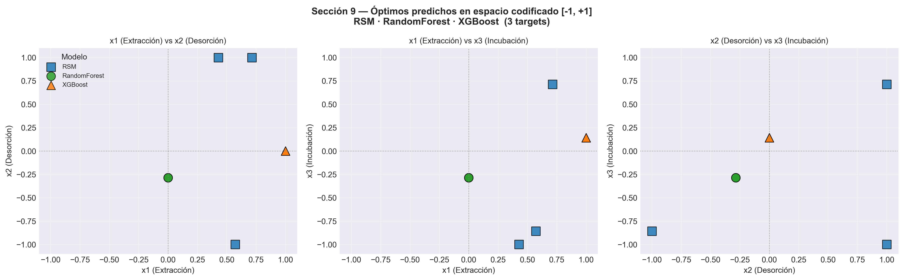

Three panels with the planes $x_1$ vs $x_2$, $x_1$ vs $x_3$, and $x_2$ vs $x_3$. Points from different models are clearly separated in the planes involving $x_2$ and $x_3$. In the $x_1$ vs $x_2$ plane, all points are located in the high-$x_1$ zone, confirming consensus on that factor. The dispersion in $x_2$ and $x_3$ is what prevents defining a single optimal point without experimental validation.

---

## Conclusions

**C1 — Main scientific finding**

Extraction time ($x_1$) is the dominant factor of the system regardless of the analysis method used. This result appears in bivariate correlations ($r = 0.825$ with Y_intensity), in the DOE main effects, in RSM coefficients (most important term in all three models), in RandomForest and XGBoost feature importance (~70% of total), in SHAP values ($x_1$ first across all targets), and in PDP curves (increasing and pronounced trend). The convergence of eight different methods gives this finding exceptional robustness.

**C2 — Two objective functions, two different responses**

D_global and D_biomarkers do not lead to the same observed optimum. D_global points to experiment 10 (axial point) as the best in the base scenario. D_biomarkers identifies experiment 5 (factorial) as the best observed (D = 0.839), and central points as the most stable on average (mean D = 0.741, std = 0.021). The choice of objective function must be guided by the biological goal: if what matters is reproducibility and biomarker panel coverage, D_biomarkers and the central points are the most appropriate reference.

**C3 — RSM limitations with N = 17**

RSM models fit well in training ($R^2 = 0.81$–$0.92$) but generalize poorly in LOOCV for Y_detected and D_biomarkers (negative $R^2_\text{LOOCV}$). This is not an implementation error but a structural consequence: a full second-order model with 10 terms applied to 17 points leaves very few degrees of freedom for cross-validation. RSM is useful as an interpretation tool (curvature, direction, term importance) but should not be used as the sole predictive engine for the optimal decision.

**C4 — Machine Learning provides additional predictive capacity**

GaussianProcess is the best individual model for Y_intensity ($R^2_\text{CV} = 0.70$). RandomForest is the most balanced model across targets and the winner of the global ranking. ML models confirm the dominance of $x_1$ and improve generalization compared to RSM, though all are limited by sample size. The practical conclusion is not that ML is "better than DOE", but that both approaches are complementary: DOE provides experimental structure and efficiency, while ML provides predictive flexibility.

**C5 — Optima are regions, not single points**

The low agreement between RSM, RandomForest, and XGBoost in the optimization phase is an honest signal of uncertainty in locating the optimum, not a flaw in the analysis. The recommended search region for a confirmatory campaign is:

| Factor | Recommendation |
|--------|---------------|
| $t_\text{extraction}$ ($x_1$) | **85 – 120 min** — prioritize the upper end of the range |
| $t_\text{desorption}$ ($x_2$) | **1.0 – 2.5 min** — low to moderate desorption |
| $t_\text{incubation}$ ($x_3$) | **5 – 15 min** — intermediate range; adjust according to priority target |

Experimentally validate at least 3 conditions in this region before fixing the definitive protocol.

**C6 — Aspects to review before the next iteration**

- The figure panels for SHAP, permutation importance, and PDP are visually very similar across targets. Verify that each figure reflects the model trained on the correct target.
- RSM_3 extrapolates outside $[0, 1]$ for D_biomarkers ($Y^* = 1.36$). Restrict the search domain to the experimental space covered by the DOE in future analyses.
- N = 17 is a real limitation. If the objective is a reliable predictive model, the learning curve analysis recommendation is to add confirmatory experiments, not to tune hyperparameters.

---

## Repository structure

```
.
|-- DOE_ML_Optimization.ipynb
|-- Excel/
|   |-- Diseño Experimental.xlsx
|   |-- Optimización Diseño Experimental ML.xlsx
|   |-- Lista Metabolitos de Interés.xlsx
|-- Figuras/
|   |-- 01_validacion_preliminar.png
|   |-- 02_design_matrix_coded.png
|   |-- 03_desirability_escenarios.png
|   |-- 04_01_response_distributions.png
|   |-- 04_02_factors_vs_response.png
|   |-- 04_02b_3d_design_space.png
|   |-- 04_03_correlation_matrix.png
|   |-- 04_05_boxplots_classification.png
|   |-- 04_06_main_effects.png
|   |-- 04_07_interaction_plots.png
|   |-- 05_02_rsm_parity_plots.png
|   |-- 05_03_rsm_surface_contour.png
|   |-- 05_04_rsm_residuals_diagnostic.png
|   |-- 05_06_rsm_importance_ranking.png
|   |-- 06_01_desirability_distributions.png
|   |-- 06_02_desirability_global.png
|   |-- 06_03_desirability_by_classification.png
|   |-- 06_04_desirability_experiments.png
|   |-- 06_05_correlation_matrix.png
|   |-- 06_04_ml_parity_plots.png
|   |-- 06_05_feature_importance.png
|   |-- 06_06_learning_curves.png
|   |-- 06_07_predictions_correlation.png
|   |-- 07_01_residuals_vs_predicted.png
|   |-- 07_02_qq_plots.png
|   |-- 08_01_shap_summary.png
|   |-- 08_02_permutation_importance.png
|   |-- 08_03_partial_dependence.png
|   |-- 09_01_optimal_space.png
```

---

## Requirements

```bash
pip install pandas numpy matplotlib seaborn scikit-learn xgboost shap scipy statsmodels openpyxl
```

Python 3.9+. Versions: pandas>=1.5, numpy>=1.23, matplotlib>=3.6, seaborn>=0.12, scikit-learn>=1.1, xgboost>=1.7, shap>=0.41, scipy>=1.9, statsmodels>=0.13, openpyxl>=3.0.

---

## Usage

1. Clone or download the repository.
2. Ensure the three Excel files are located in the `Excel/` folder.
3. Run the notebook sequentially (Section 1 → 10):

```bash
jupyter notebook DOE_ML_Optimization.ipynb
```

---

## References

- Derringer, G., Suich, R. (1980). Simultaneous optimization of several response variables. *Journal of Quality Technology*, 12(4), 214–219.
- Jové, M. et al. (2021). Multivariate exploration of the metabolic profiling of fecal samples. *Analytical and Bioanalytical Chemistry*.
- Box, G.E.P., Hunter, J.S., Hunter, W.G. (2005). *Statistics for Experimenters*. Wiley.
- Lundberg, S.M., Lee, S.I. (2017). A unified approach to interpreting model predictions. *NeurIPS 2017*.
- Breiman, L. (2001). Random forests. *Machine Learning*, 45(1), 5–32.
- Chen, T., Guestrin, C. (2016). XGBoost: A scalable tree boosting system. *KDD 2016*.

---

*Analysis developed as part of a metabolomics optimization project using statistical design of experiments and supervised machine learning models.*
